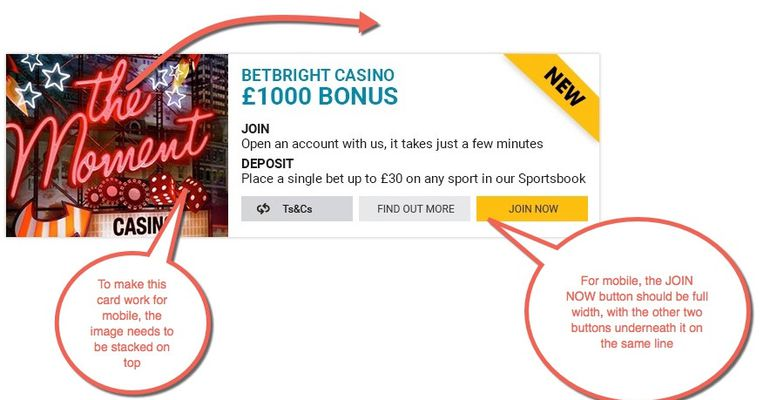

# Frontend Developer Test
The frontend developer test consists of 3 sections:
- Design Markup
- JS Exercise
- PHP Exercise

## 1. DESIGN MARKUP
For this task you are required to mark up the card as [shown in the demo](https://marvelapp.com/a886dh) using pure html & css.
- Do not use any framework such as foundation, bootstrap etc;
- You can use a system font;
- Use images where you see fit as part of the implementation;
- Links and buttons should have a hover state;
- The "Terms & Conditions" on the back of the card should be scrollable;
- The "flip" animation can be implemented anyway you see fit;
- The card has to be centered on the screen;
- The card should be responsive, when the screen size goes below 600px the card should resize. Guidelines are detailed in the image below.

## 2. JAVASCRIPT EXERCISE
Create a HTML page with 3 buttons:
- Cow, Dog, Giraffe

Using the [flickr public API](https://www.flickr.com/services/feeds/docs/photos_public/) load 5 images of the click animal:
  1. The API request should be made using AJAX instead of a page load
  2. You cannot use jQuery, you must use native JavaScript.

## 3. PHP EXERCISE
**Date calculation:** The Irish lottery draw takes place twice weekly on a Wednesday and a Saturday at 8pm. Write a function that calculates and returns the next valid draw date based on the current date and time and also on an optional supplied date.
